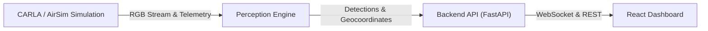
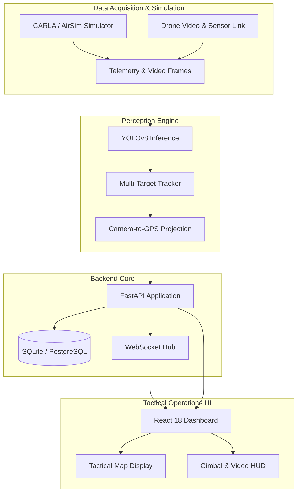

# ReconEye ✈️ — Autonomous Drone ISR Platform

[](https://www.python.org/)
[](https://react.dev/)
[](https://fastapi.tiangolo.com/)
[](LICENSE)

**ReconEye** is a production-grade, full-stack Autonomous Drone Intelligence, Surveillance, and Reconnaissance (ISR) platform. Built to bridge advanced aerial computer vision with mission control operations, ReconEye ingests live simulated and hardware telemetry, performs high-frequency multi-class object detection and spatial tracking, computes accurate real-world georeferenced coordinates, and broadcasts synchronized operational telemetry to a responsive, military-grade tactical web dashboard.

---

<!-- Screenshot placeholder -->
```
+-----------------------------------------------------------------------------------+
|                                  [ SCREENSHOT ]                                   |
|                                                                                   |
|           TODO: ReconEye Mission Control Tactical Dashboard & Live Video          |
|                                                                                   |
+-----------------------------------------------------------------------------------+
```

---

## ⚡ Key Features

- 🎯 **Real-Time Target Detection & Multi-Object Tracking**: High-performance YOLOv8 / ONNX vision pipeline detecting vehicles, personnel, vessels, and custom military ISR classes with persistent ByteTrack/DeepSORT association.
- 🗺️ **Georeferencing & Spatial Projection**: Instant conversion of camera-frame pixel bounding boxes into GPS latitude, longitude, and elevation coordinates projected on live tactical map layers.
- ⚡ **Ultra-Low Latency Streaming & Telemetry**: WebSocket-driven full-duplex telemetry feeds distributing drone state, gimbal angles, battery metrics, and vision inferences at 30+ FPS.
- 🤖 **Autonomous Mission & Flight Planning**: Intelligent waypoint trajectory generation, search-and-rescue sweep grids, and dynamic loiter patterns with real-time zone boundary compliance.
- 🎮 **Simulation & Hardware-in-the-Loop Integration**: Seamless ingestion from CARLA Simulator, Microsoft AirSim, or standard RTSP/GStreamer drone camera feeds with an automatic zero-config demo mode.
- 📊 **Tactical Recon Analytics & Alerts**: Automated boundary intrusion detection, high-priority target alerts, historic flight trail visualization, and mission debrief export capabilities.

---

## 🏗️ Architecture



### Detailed Pipeline



---

## 💻 Tech Stack

| Layer | Technologies |
|---|---|
| **Perception Engine** | Python 3.11, YOLOv8 (Ultralytics), OpenCV, NumPy, ONNX Runtime |
| **Backend & Services** | FastAPI, Uvicorn, SQLAlchemy (AsyncIO), aiosqlite, Pydantic v2 |
| **Frontend & Dashboard** | React 18, TypeScript, Vite, TailwindCSS, Lucide React, Leaflet / MapLibre |
| **Real-Time Transport** | WebSockets, JSON & Binary Streaming |
| **Simulation Bridges** | CARLA Simulator Python API, Microsoft AirSim RPC Client |
| **DevOps & Infrastructure** | Docker, Docker Compose, Nginx, GitHub Actions CI |

---

## 🚀 Quick Start

### Prerequisites

- **Python 3.11+** installed
- **Node.js 20+** and **npm** installed
- **Docker & Docker Compose** (optional for containerized execution)

---

### Option 1: Docker Compose (Recommended)

Run the entire platform (FastAPI backend + Nginx-served React frontend) in containers:

```bash
# Clone the repository
git clone https://github.com/your-org/recon-eye.git
cd recon-eye

# Copy environment template
cp .env.example .env

# Build and launch all services
docker compose up --build
```

- **Tactical Dashboard**: [http://localhost:3000](http://localhost:3000)
- **FastAPI Documentation**: [http://localhost:8000/docs](http://localhost:8000/docs)

---

### Option 2: Manual Local Setup

#### 1. Backend Setup

```bash
# From the project root
python -m venv venv

# Activate virtual environment
# Windows (PowerShell):
.\venv\Scripts\Activate.ps1
# Linux / macOS:
source venv/bin/activate

# Install dependencies
pip install --upgrade pip
pip install -r backend/requirements.txt

# Start FastAPI server
uvicorn backend.main:app --host 0.0.0.0 --port 8000 --reload
```

#### 2. Frontend Setup

```bash
# In a new terminal window
cd frontend

# Install dependencies
npm install

# Start Vite dev server
npm run dev
```

The frontend development server will launch at [http://localhost:5173](http://localhost:5173) (or [http://localhost:3000](http://localhost:3000) depending on configuration).

---

## 📂 Project Structure

```
recon-eye/
├── .github/
│   └── workflows/
│       └── ci.yml               # GitHub Actions CI workflow
├── backend/
│   ├── api/                     # REST and WebSocket route handlers
│   ├── main.py                  # FastAPI application entrypoint
│   └── requirements.txt         # Python dependencies
├── frontend/
│   ├── src/                     # React components, hooks, and views
│   ├── nginx.conf               # Production Nginx reverse proxy configuration
│   └── package.json             # Frontend dependencies & scripts
├── perception/
│   ├── detector.py              # YOLOv8 object detection module
│   ├── tracker.py               # Multi-target spatial tracker
│   └── georeference.py          # Pixel-to-GPS coordinate transformer
├── mission_planner/
│   ├── planner.py               # Autonomous waypoint and sweep generator
│   └── safety.py                # Geofence enforcement and battery limits
├── simulation/
│   ├── carla_bridge.py          # CARLA simulator integration client
│   └── demo_stream.py           # Standalone synthetic drone telemetry simulator
├── docker-compose.yml           # Multi-service container orchestration
├── Dockerfile.backend           # Python 3.11 backend container spec
├── Dockerfile.frontend          # Multi-stage Vite + Nginx frontend build
├── .env.example                 # Example environment variables
├── .gitignore                   # Git ignore rules
├── LICENSE                      # MIT License
└── README.md                    # Platform documentation
```

---

## 📖 API Documentation

FastAPI automatically generates interactive API documentation. When the backend service is running:

- **Swagger UI**: [http://localhost:8000/docs](http://localhost:8000/docs)
- **ReDoc**: [http://localhost:8000/redoc](http://localhost:8000/redoc)

---

## 🤝 Contributing

Contributions are welcome! Please follow these steps:

1. Fork the repository.
2. Create your feature branch (`git checkout -b feature/tactical-enhancement`).
3. Commit your changes (`git commit -m 'Add tactical radar overlay'`).
4. Push to the branch (`git push origin feature/tactical-enhancement`).
5. Open a Pull Request against the `main` branch.

Please ensure your code passes linting and tests (`pytest` and `npm run lint`) before submitting.

---

## 📄 License

This project is licensed under the MIT License — see the [LICENSE](LICENSE) file for details.
